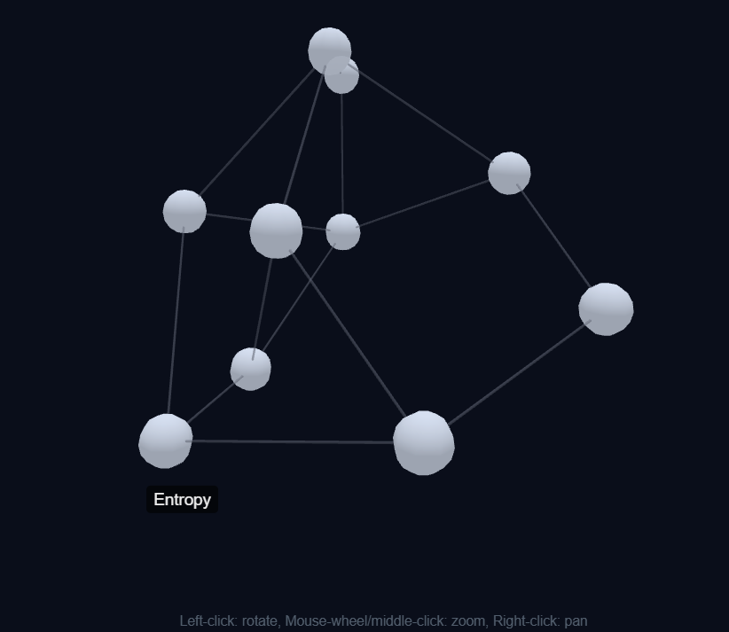

# Synapse3D

A browser-based 3D knowledge graph navigated by hand gestures - your note vault as a constellation, manipulated in midair via webcam.

> **Status:** Phase 0 complete. Vault parser (Phase 1) next.

<p align="center">
  
</p>

## What it is

Most note-taking tools render knowledge as 2D graphs. Synapse3D treats your vault as a spatial environment: nodes float in 3D, links are visible from any angle, and navigation happens through hand gestures tracked by your webcam - pinch to select, grab to pull, two-hand spread to zoom.

The goal is a tactile, low-friction way to *think with* your notes instead of clicking through them.

## Why it's interesting (technically)

- **Real-time on-device ML.** MediaPipe HandLandmarker produces 21 3D landmarks per frame per hand at 30+ fps, fully in-browser. Gesture classification and temporal smoothing happen client-side - no server round-trip.
- **Noisy input → smooth interaction.** Raw landmarks jitter. One-euro filtering, pinch debouncing, and selection-ray snapping are necessary just to make the UX feel responsive instead of haunted.
- **Spatial layout in 3D.** Force-directed simulation has more degrees of freedom than 2D - overlapping clusters, depth ambiguity, and camera framing all become design problems.
- **Local-first.** No backend. Vault parsing via the File System Access API, all processing in-browser.

## Stack

| Layer | Choice | Why |
|---|---|---|
| Build | Vite | Fast HMR, minimal config. |
| Rendering | three.js + 3d-force-graph | three.js for raw control later (shaders, post-processing); 3d-force-graph handles physics out of the box. |
| Hands | MediaPipe Tasks (HandLandmarker) | Pretrained, runs in WASM/WebGL, no native deps. |
| Data | Obsidian-format markdown vault | Plain `.md` files, `[[wikilinks]]` and `#tags` parsed locally. |
| Smoothing | One-euro filter | De-jitters landmark stream without adding lag. |

## Roadmap

| Phase | Focus | State |
|---|---|---|
| 0 | Vite + 3d-force-graph skeleton | ✅ |
| 1 | Vault parser (markdown → graph) | - |
| 2 | MediaPipe hand tracking + overlay | - |
| 3 | Pinch to select | - |
| 4 | Pinch + hold to grab | - |
| 5 | Open palm to orbit camera | - |
| 6 | Two-hand spread to zoom | - |
| 7 | Polish - bloom, HUD, legend | - |

See [ROADMAP.md](./ROADMAP.md) for the full plan, including v2 stretch goals (voice control via Claude tool use, custom gesture classifier, semantic search via embeddings).

## Run locally

```bash
npm install
npm run dev
```

Open http://localhost:5173.

## License

[MIT](./LICENSE)
