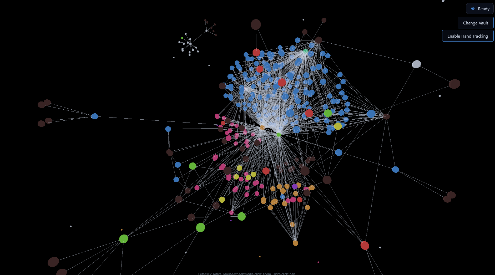
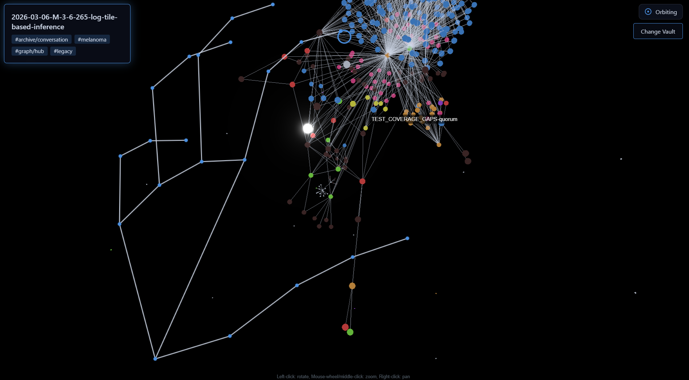
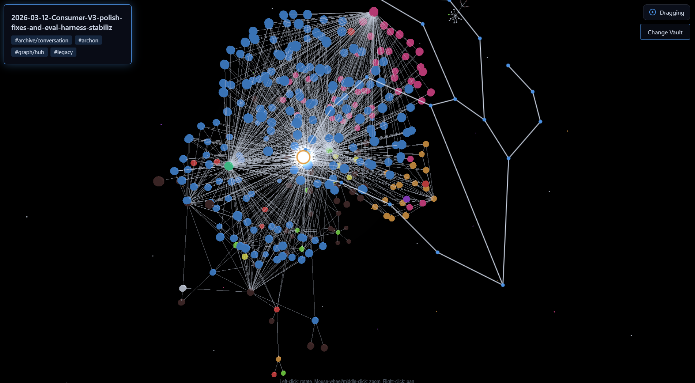

# Synapse3D

Hand-controlled 3D knowledge graph for Obsidian vaults. Synapse3D renders local notes as a living constellation in the browser: pinch to select, pinch-hold to drag, open your palm to orbit, and spread two hands to zoom. No install beyond the web app, no server, no note upload.

[](https://github.com/aiedwardyi/synapse3d/actions/workflows/ci.yml)
[](LICENSE)
[](https://github.com/aiedwardyi/synapse3d/releases)

<p align="center">
  
  
  
</p>

> v1.0.0 is release-ready. A short gesture demo video and hosted demo URL are the remaining launch assets.

## What it demonstrates

- **Real-time browser interaction:** webcam hand tracking, 3D raycasting, force-directed rendering, post-processing, and camera control all run client-side.
- **Local-first product judgment:** notes stay on disk; the app uses the File System Access API instead of asking users to upload a private vault.
- **Gesture system design:** each gesture has explicit detection, hysteresis, priority, and controller boundaries so selection, drag, orbit, and zoom do not fight each other.
- **Testable architecture:** interaction math and DOM orchestration are split into small modules with focused `node:test` coverage.
- **Production discipline:** CI runs tests and builds on every push/PR, release notes are tracked, and security/contribution policies are documented.

## Quick start

Requirements: Node 20+, a Chromium-based desktop browser, and a webcam.

```bash
git clone https://github.com/aiedwardyi/synapse3d.git
cd synapse3d
npm ci
npm run dev
```

Open `http://localhost:5173`, click _Pick a vault_, grant webcam permission, then click _Enable hand tracking_.

## Gesture vocabulary

| Gesture | Action |
| --- | --- |
| Pinch (thumb + index) | Select a node |
| Pinch and hold, then move | Drag the selected node along its depth plane |
| Open palm (one hand) | Orbit the camera around the current target |
| Two open palms, change spread | Zoom: spread to zoom in, close to zoom out |

Selected nodes glow through `UnrealBloomPass` post-processing. A live HUD shows the current gesture state, and a first-run modal teaches the vocabulary before suppressing itself through `localStorage`.

## Architecture

Synapse3D is intentionally plain JavaScript. The complexity is in the interaction model, not in a framework layer.

1. **Vault ingestion:** `src/vault.js` reads an Obsidian-format directory with the File System Access API, parses `[[wikilinks]]` into graph edges, and extracts `#tags` for color clustering.
2. **Hand tracking:** `src/hand-tracking.js` wraps MediaPipe Tasks `HandLandmarker`, producing up to two 21-point hands per video frame.
3. **Coordinate mapping:** `src/landmark-transform.js` maps source-pixel landmarks into mirrored viewport coordinates while accounting for `object-fit: cover` cropping.
4. **Gesture detection:** `src/gestures.js` computes hand-scale-normalized pinch and palm-openness ratios with hysteresis and one-euro filtering.
5. **Gesture resolution:** `src/main.js` applies the priority order `drag > zoom > orbit > select > idle`.
6. **Scene control:** `src/drag.js`, `src/camera-orbit.js`, and `src/camera-zoom.js` mutate graph/camera state through narrow controller APIs.
7. **Rendering:** `three.js` and `3d-force-graph` render the note constellation, while selected nodes cross the bloom threshold through emissive material changes.

## Project structure

```text
synapse3d/
├── .github/workflows/
│   ├── ci.yml                 test + build gate for pushes and PRs
│   └── claude-review.yml      opt-in AI review workflow for PRs
├── docs/
│   └── demo*.png              README and reference screenshots
├── public/
│   └── favicon.svg
├── src/
│   ├── main.js                app bootstrap and gesture priority loop
│   ├── vault.js               File System Access vault picker + parser
│   ├── vault-controller.js    vault-picker button orchestration
│   ├── hand-tracking.js       MediaPipe HandLandmarker wrapper
│   ├── hand-tracking-ui.js    tracking-button state helpers
│   ├── hand-overlay.js        landmark and fingertip cursor rendering
│   ├── handedness.js          stable left/right hand bucketing
│   ├── landmark-transform.js  cover transform + mirror mapping
│   ├── gestures.js            pinch, palm, and smoothing primitives
│   ├── gesture-raycasting.js  screen-point to scene raycast adapter
│   ├── drag.js                pinch-drag controller
│   ├── camera-orbit.js        open-palm orbit controller
│   ├── camera-zoom.js         two-hand zoom controller
│   ├── node-mesh.js           node mesh creation + highlight material state
│   ├── node-selection-hit.js  click-handler to selection-hit adapter
│   ├── pinch-selection-attempt.js  one-shot pinch-to-select state machine
│   ├── material-tracker.js    GPU material disposal tracking
│   ├── selection-panel.js     selected-node info panel
│   ├── gesture-hud.js         live gesture state indicator
│   ├── gesture-legend.js      first-run modal overlay
│   ├── gesture-legend-storage.js  localStorage wrapper with fallbacks
│   └── style.css              dark UI, graph surface, HUD, modal
├── test/                      one focused test file per behavior module
├── CONTRIBUTING.md            local setup, PR bar, review expectations
├── SECURITY.md                disclosure process and privacy boundaries
├── CURRENT_SPRINT.md          launch checklist and immediate next actions
├── ROADMAP.md                 shipped phases and stretch direction
└── vite.config.js             build config and vendor chunk grouping
```

## Testing

```bash
npm test
npm run build
```

The suite currently has 172 unit tests covering gesture math, camera controllers, drag behavior, vault parsing, handedness bucketing, landmark transforms, raycasting, storage fallbacks, and DOM modules. Tests are pure Node tests; MediaPipe and the browser are not required at test time.

## Browser support

Supported: Chromium-based desktop browsers such as Chrome, Edge, Brave, and Arc.

Requirements:

- File System Access API
- Webcam access over HTTPS or `localhost`
- ES2022+ JavaScript

Not supported: Firefox, Safari, and mobile browsers. This is a deliberate v1 tradeoff: Chromium is currently the cleanest way to read a local Obsidian vault without an upload step.

## Privacy and security

Synapse3D has no backend. Vault files are read locally, webcam frames are processed in the browser, and the app stores only a cached directory handle plus small UI preferences such as first-run legend dismissal.

Security reports should follow [SECURITY.md](SECURITY.md). Please do not publish exploit details in a public issue before there is a maintainer response path.

## Contributing

Contributions are welcome when they preserve the project shape: local-first, browser-native, small modules, and focused tests. See [CONTRIBUTING.md](CONTRIBUTING.md) for setup, PR expectations, and the review checklist.

Useful project docs:

- [CURRENT_SPRINT.md](CURRENT_SPRINT.md) - v1.0.0 launch checklist
- [ROADMAP.md](ROADMAP.md) - shipped phases and future directions

## Release notes

### v1.0.0

- Full gesture vocabulary: pinch select, pinch drag, single-hand orbit, two-hand zoom
- Obsidian vault parsing with `[[wikilink]]` edge extraction and `#tag` color clustering
- UnrealBloomPass selection highlight
- Live gesture HUD and first-run legend with accessibility-conscious markup
- 172 unit tests, CI on main

## License

MIT. See [LICENSE](LICENSE).
